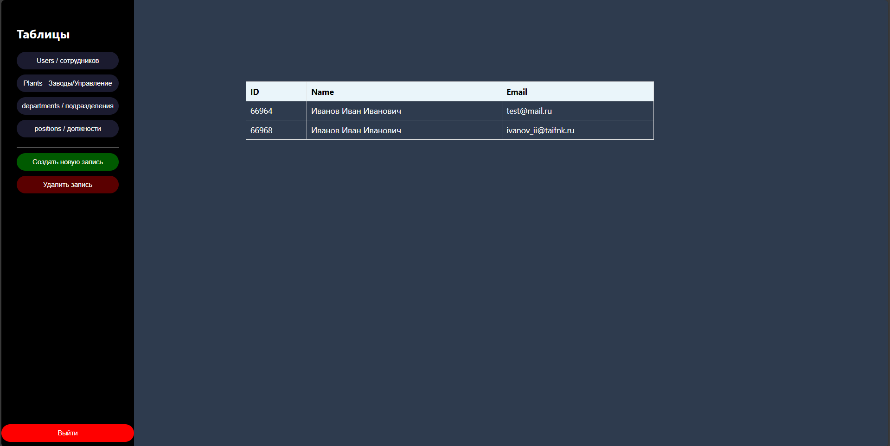
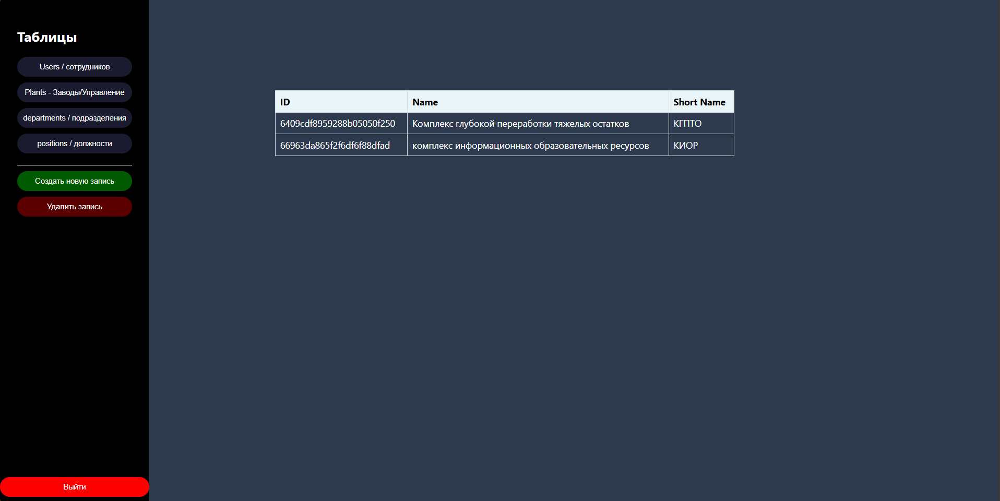
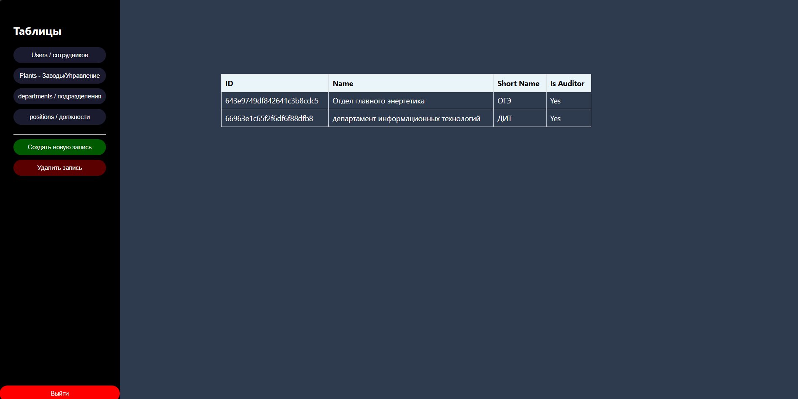
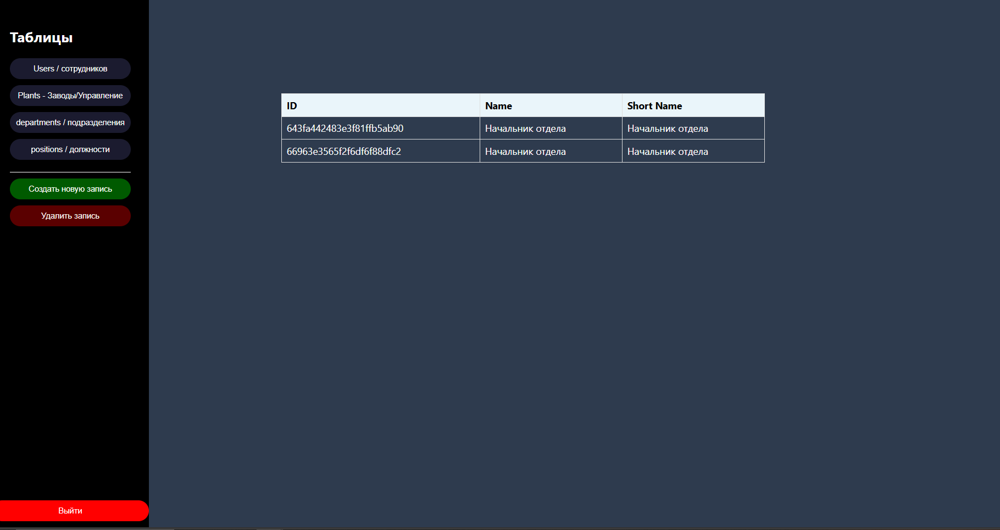
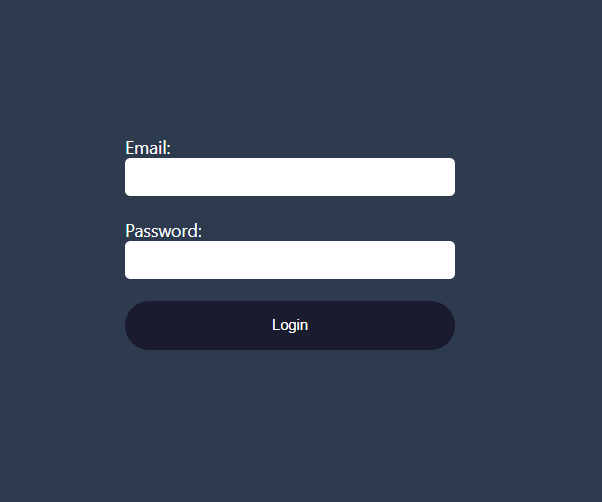

## Приложение интерфейс админка

Приложение - интерфейс админки для ведений пользователями

### Возможности админки

- Авторизация (без пароля т.е пустую строку не примет )
- Создание нового пользователя (ви)ремено отключен исправляются ошибк
- Просмотр информации о пользователях
- Редактирование существующего пользователя (времено отключен исправляются ошибки)
- Удаление пользователей (времено отключен исправляются ошибки)

- P.s (Ошибки будут исправлены)
### Технологии

- React
- Node.js
- Express.js
- MongoDB

### Запуск и развертывание

1. Клонируйте репозиторий
    https://github.com/Orakl-1/WebAplic.git

В проекте доступны следующие скрипты:

### npm start
Запускает приложение в режиме разработки.
Открывает http://localhost:3000 в вашем браузере.

Страница будет перезагружаться при внесении изменений.
Вы также можете увидеть ошибки линтинга в консоли

Создание базы (предприятия/enterprises)

## Интерфейс React
### Users

### Plant

### departments

### positions

### Форма Логина

